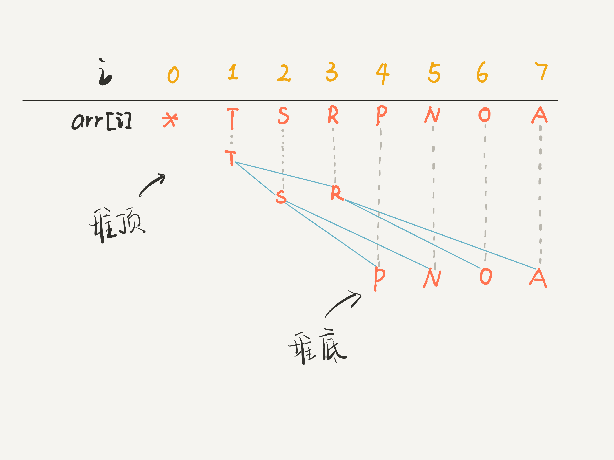

# 堆

一般指二叉堆，本质上是一棵完全二叉树，但其元素排布有序。 
堆一般不像二叉树用于递归/迭代遍历，而是在特定规则下维护堆，即在插入/删除时自动排序，并从堆顶获取预期结果。 

## 存储

二叉树使用多叉链表存储，而二叉堆使用数组。 
一般链表二叉树，操作节点的指针；但在数组中，使用索引作为指针。 

- 索引从0开始时：父节点i，左孩子2i + 1，右孩子2i + 2； 
- 索引从1开始时，父节点i，左孩子2i，右孩子2i + 1。 

## 作用

- 优先级队列
    - 大顶堆：堆顶元素最大，每个节点均大于孩子节点； 
    - 小顶堆：堆顶元素最小，每个节点均小于孩子节点。 

## 操作

- swim上浮： 
  向堆中新增元素时，通常追加在**堆尾**。此时堆的性质可能被破坏，需要调整。 
    1. 子节点跟父节点比较大小，若不满足大顶堆/小顶堆要求，则交换； 
    2. 重复该操作直到遍历到堆顶，即无法继续上浮。 
- sink下沉： 
  从堆顶弹出元素后，**堆顶**出现空洞。此时从堆尾抓一个元素替补，堆的性质可能被破坏，需要调整。 
    1. 父节点跟两个子节点比较大小，若不满足大顶堆/小顶堆要求，则交换； 
    2. 重复该操作直到遍历到堆尾，即无法继续下沉。 

错位的节点可能要上浮/下沉多次，才能到达正确的位置，恢复堆的性质。所以代码中会有for循环。