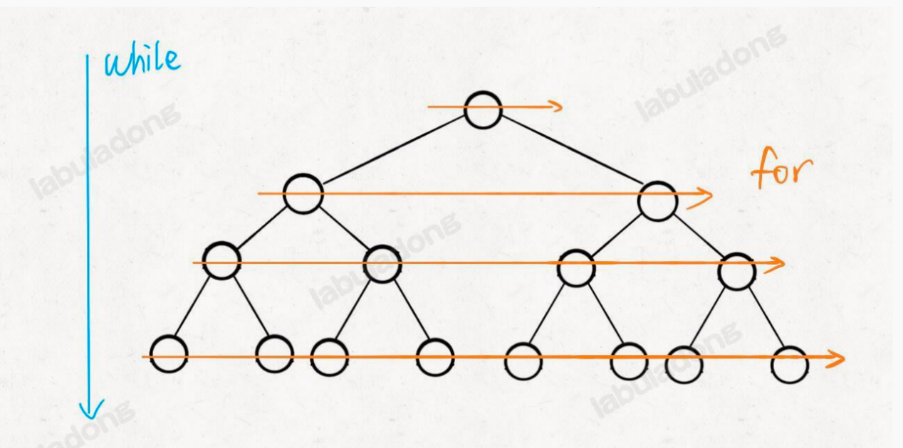

# 核心

- 通过辅助队列，维护入列/出列顺序，从而实现从左到右、由上至下的层序遍历。

# 模板

```
func levelTraverse(root *TreeNode) {
    if root == nil {
        return
    }
    queue := []*TreeNode{root}
    for len(queue) > 0 {
        sz := len(queue)
        // 处理当前层节点
        for i := 0; i < sz; i++ {
            // 出队
            cur := queue[0]
            queue = queue[1:]
            // 下层节点入队
            if cur.Left != nil {
                queue = append(queue, cur.Left)
            }
            if cur.Right != nil {
                queue = append(queue, cur.Right)
            }
        }
    }
}
```

# 图解



